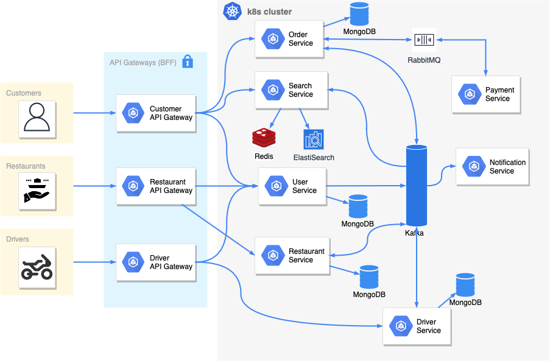

# Awesome Delivery

Awesome delivery is a prepared food delivery service. It uses several microservice for doing its task!

## Requirements and Goals of the system

Actors of the system:

- Customers
- Restaurants
- Drivers

Functional requirements

- Customer should search for restaurants, choose menu items and create an order.
- Customer should be able to see the status of its order.
- Restaurants should be able to see orders and accept/reject.
- Drivers should be able to see orders that are ready for pickup and deliver them.
- All actors should get notification.

## System Design



## Deployment

The service deploy and run on kubernetes cluster. Therefore, we need to perpare the infrastructure before deployment.

Preparing infrastructure (Google Cloud):

1. Setup [Google Kubernetes Engine](https://istio.io/latest/docs/setup/platform-setup/gke/) & install [Istio](https://istio.io/latest/docs/setup/getting-started/)
2. Install Infra services using [helm](https://helm.sh)

```bash
$ ./deploy/scripts/setup_infra.sh
```

3. Deploy services

```bash
$ kubectl apply -f ./deploy
```
